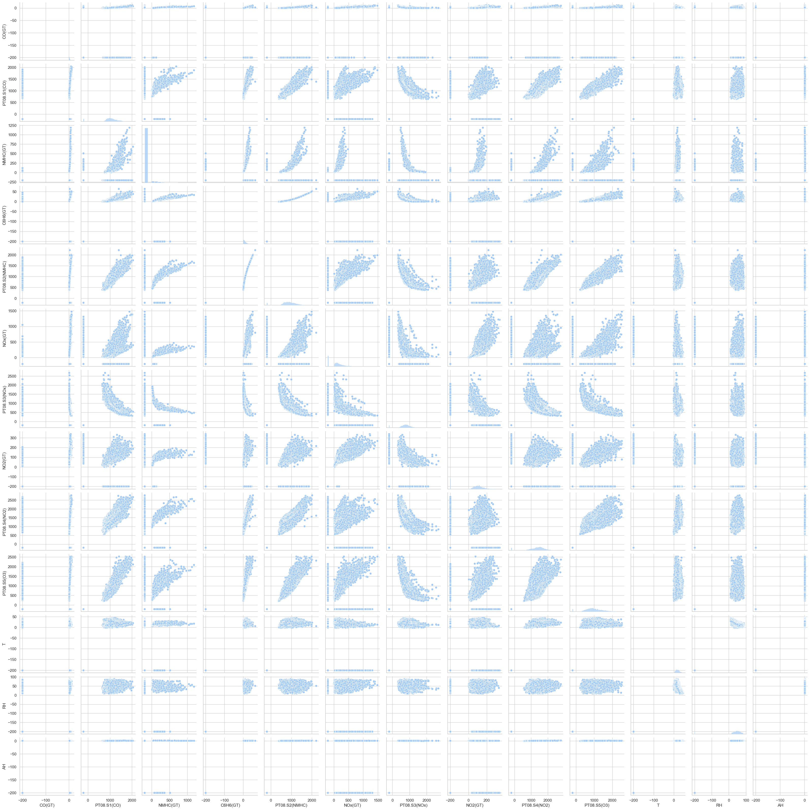
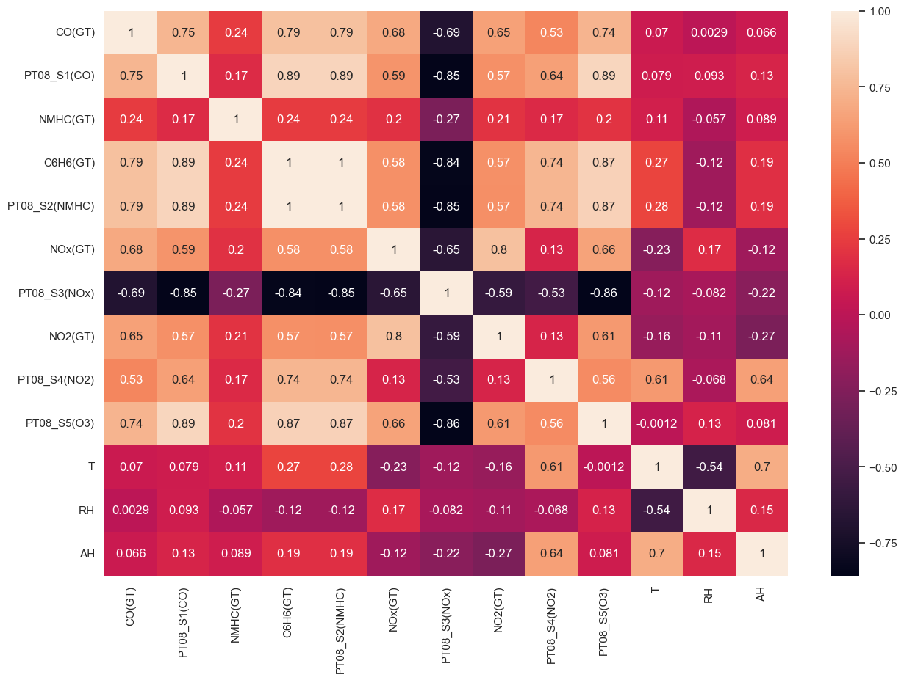
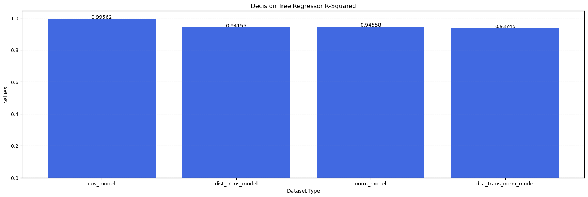
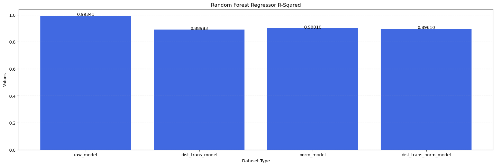

# Air Quality Analysis using PySpark

This project focuses on analyzing air quality data using PySpark and pandas, two popular libraries in the field of data processing and analysis. The dataset used for this project is the "Air Quality Dataset Hourly averaged responses from an array of 5 metal oxide chemical sensors" available on Kaggle.

## Dataset Description

The "Air Quality Dataset Hourly averaged responses from an array of 5 metal oxide chemical sensors" contains hourly averaged responses from an array of 5 metal oxide chemical sensors embedded in an Air Quality Chemical Multisensor Device. The data was collected in a controlled chamber with a gas analyser reference device and 5 metal oxide chemical sensors. The goal is to estimate the relative humidity and temperature values based on the response of the chemical sensors.

0) Date (DD/MM/YYYY)
1) Time (HH.MM.SS)
2) True hourly averaged concentration CO in mg/m^3 (reference analyzer)
3) PT08.S1 (tin oxide) hourly averaged sensor response (nominally CO targeted)
4) True hourly averaged overall Non Metanic HydroCarbons concentration in microg/m^3 (reference analyzer)
5) True hourly averaged Benzene concentration in microg/m^3 (reference analyzer)
6) PT08.S2 (titania) hourly averaged sensor response (nominally NMHC targeted)
7) True hourly averaged NOx concentration in ppb (reference analyzer)
8) PT08.S3 (tungsten oxide) hourly averaged sensor response (nominally NOx targeted)
9) True hourly averaged NO2 concentration in microg/m^3 (reference analyzer)
10) PT08.S4 (tungsten oxide) hourly averaged sensor response (nominally NO2 targeted)
11) PT08.S5 (indium oxide) hourly averaged sensor response (nominally O3 targeted)
12) Temperature in °C
13) Relative Humidity (%)
14) AH Absolute Humidity

More Notes:

- GT = Global Throposphere

## Project Overview

This project follows a modular approach, with separate files for data preprocessing, data analysis, and model development. The main focus is on utilizing PySpark to preprocess the data, perform exploratory data analysis, and build a machine learning model for predicting air quality parameters.

The project involves the following steps:

1. **Data Preprocessing**: In this step, the raw dataset is cleaned, transformed, and prepared for further analysis. Data cleaning involves handling missing values, removing duplicates, converting datetime data, distribution optimizer method and normalizing data.

2. **Data Analysis**: Once the data is preprocessed, exploratory data analysis techniques are applied using Pandas and Plotly. Various statistical measures, visualizations, and insights are derived to understand the characteristics and patterns present in the dataset. This step helps in gaining a deeper understanding of the air quality data.

3. **Model Development**: After the data analysis, a machine learning model is developed using PySpark. The model is trained on the preprocessed dataset to predict air quality parameters specifically temperature. Different algorithms, such as decision tree regression and random forest regressor models, the models evaluated based on their performance metrics.

By following this modular approach, the project aims to provide a comprehensive understanding of the air quality dataset and enable accurate predictions of air quality parameters using machine learning techniques.

Note: The code for this project, including the data preprocessing, analysis, and model development, can be found in the respective files in the project repository.

# Data Analysis Overview

- **Pairplot**

From the pairplot we can see there are some data that looks flat like NMHC(GT), that flat data are the outlier data that already been change with the mean value, since the outlier has being plot againts each other column the result is give us the flat data that we can look in the pairplot.

- **Correlation Matrix**

From the pairplot above we know that:

- Benzene has correlation with another columns except CO(GT), NOx, T, RH, AH
- Carbon monokside has positive correlation with Benzene in the scale of global troposphere
- The only chemical measurements that has positive correlation is CO(GT) and PT08_S1 as the global troposphere distribute the data linear the same as the sensors data distributed
- Data in columns T, RH, AH does not show significant correlation to another columns
- using the pairplot we can know that the data has more left skewed distributed data.

# Model Result

1. Decision Tree Regressor

From the graph above we can see that the raw model has the highest value of R-squared and the norm_model has the second highest value from Random Forest Regressor model

2. Random Forest Regressor

From the graph above we can see that the raw model has the highest value of R-squared and the norm_model has the second highest value from Random Forest Regressor model

# Conclusion

From this projects we know that raw data has the best performance based on the R-squared evalutaion matrix on both model, then the only normalize data sit on the second position.  